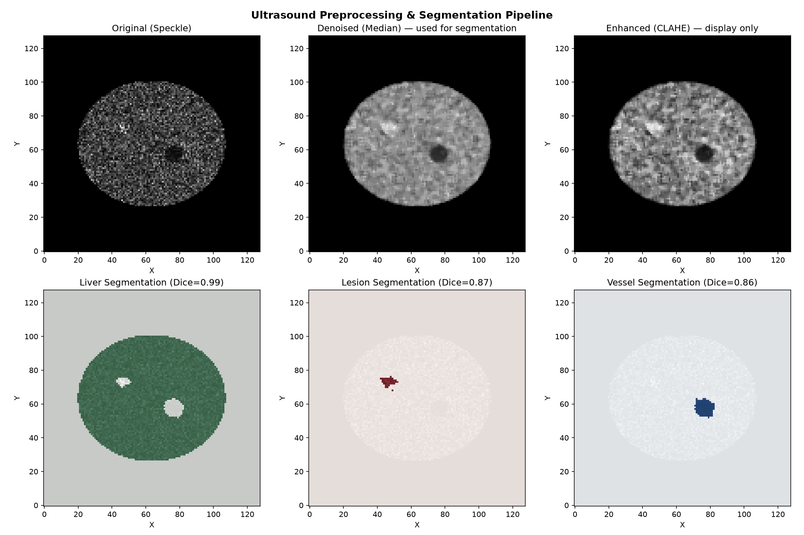
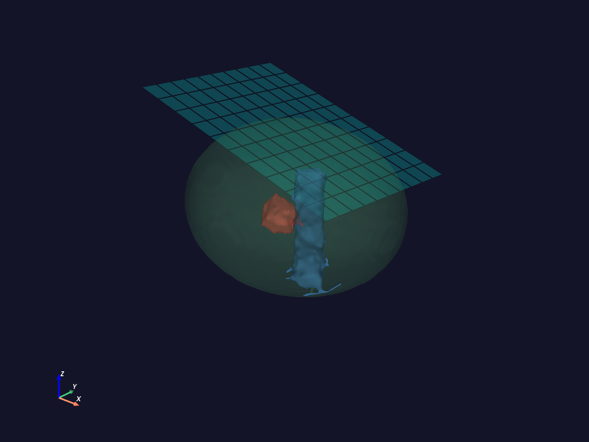
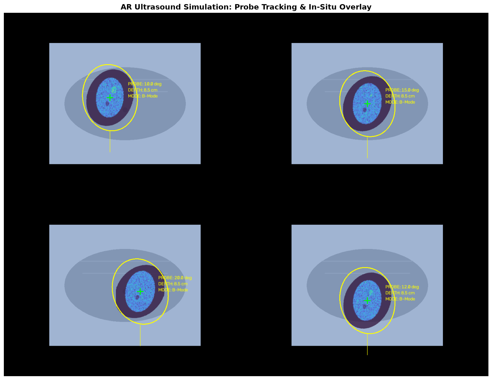

# 03 — AR-Ultrasound Probe: 3D Medical Imaging Pipeline

**Auteur:** Dini Ahamada
## Objectif

Ce projet démontre une pipeline complète de traitement d'images échographiques 3D,
de la génération de données synthétiques à la visualisation AR. Conçu comme
preuve de concept pour montrer la maîtrise des outils fondamentaux du projet de
PhD : VTK/PyVista (visualisation médicale 3D), OpenCV/scikit-image (vision par
ordinateur), et la géométrie de projection AR (probe tracking + overlay).

La pipeline segmente les structures anatomiques puis **valide quantitativement**
le résultat contre une vérité terrain (Dice score), plutôt que de s'arrêter à
une inspection visuelle des images — dans le même esprit que la validation
SHAP du projet 01 et les métriques de détection du projet 02.

## Structure du projet

| Fichier | Description |
|---------|-------------|
| `src/01_generate_phantom.py` | Génération d'un phantom abdominal 3D avec bruit speckle réaliste, et sauvegarde des masques ground-truth (foie, vaisseau, lésion, paroi) |
| `src/02_preprocess_segment.py` | Prétraitement (filtre médian, CLAHE) + segmentation (Otsu multi-niveaux, nettoyage morphologique) + évaluation quantitative (Dice) |
| `src/03_visualize_3d_vtk.py` | Visualisation 3D par isosurfaces (marching cubes) des structures segmentées, avec PyVista/VTK + plan de sonde |
| `src/04_ar_probe_simulation.py` | Simulation AR : overlay de l'image US sur le patient virtuel, avec HUD (angle/profondeur/mode) |

## Résultats visuels

### 1. Pipeline de prétraitement et segmentation

Dice foie = 0.99 · lésion = 0.87 · vaisseau = 0.86 (contre vérité terrain synthétique)

### 2. Visualisation 3D par isosurfaces (VTK/PyVista)


### 3. Simulation AR Probe


## Méthodologie

### Génération du phantom
Le phantom reproduit les caractéristiques physiques de l'imagerie ultrasonore :
- **Bruit speckle** : interférence multiplicative modélisée par une distribution
  de Rayleigh approximée.
- **Contraste échogénique** : structures hypoéchoïques (vaisseau) vs
  hyperéchoïques (lésion, paroi).
- Les masques ground-truth de chaque structure sont sauvegardés au moment de la
  génération, pour permettre une évaluation quantitative de la segmentation.

### Prétraitement et segmentation
- **Filtre médian 3D** : réduction du speckle tout en conservant les contours
  (meilleur que le gaussien pour l'US).
- **CLAHE** : amélioration du contraste local — utilisée uniquement pour
  l'affichage, jamais en entrée de la segmentation (le CLAHE, appliqué avant
  seuillage, détruit la relation entre intensité et structure anatomique).
- **Segmentation** : seuils calibrés automatiquement par Otsu multi-niveaux sur
  l'histogramme du volume débruité, puis nettoyage par composantes connexes
  (filtrage par taille et par forme — le rapport d'aspect de la boîte englobante
  distingue une lésion compacte d'une nappe fine comme la paroi abdominale).
- **Évaluation** : score de Dice calculé pour chaque structure contre le masque
  ground-truth.

### Visualisation 3D (VTK/PyVista)
- **Isosurfaces (marching cubes)** extraites des masques segmentés — chaque
  structure anatomique (foie, vaisseau, lésion) devient une surface 3D nette et
  colorée, plutôt qu'un rendu volumique brut sur données bruitées.
- **Plan de coupe** : représentation géométrique du plan d'acquisition de la
  sonde, incliné selon une orientation clinique typique.
- **Repère anatomique** : axes 3D pour situer le volume dans l'espace patient.

### Simulation AR
- **Tracking simulé** : positions et angles du probe définis paramétriquement
  (pas de tracking réel — voir Limites).
- **Extraction de slice** : reslice 2D du volume 3D selon l'orientation du probe.
- **Overlay** : projection de l'image US sur le fond caméra avec alpha blending
  et HUD (depth, angle, mode).
- **Crosshair** : marqueur de visée pour alignement clinique.

## Limites connues

- Le tracking du probe dans la simulation AR est paramétrique (angles fixés à
  l'avance), pas dérivé d'un algorithme de tracking réel (optique ou EM).
- Le phantom ne modélise pas l'atténuation du faisceau en profondeur.
- La segmentation reste une baseline interprétable (seuillage + morphologie) ;
  un système clinique utiliserait un réseau de segmentation entraîné (U-Net).

## Installation et exécution

```bash
# Cloner le portfolio et se placer dans ce projet
git clone https://github.com/Salah81/ai-healthcare-portfolio
cd ai-healthcare-portfolio/03-ar-ultrasound-imaging

# Créer l'environnement
python -m venv venv
source venv/bin/activate  # Linux/Mac
# ou: venv\Scripts\activate  # Windows

# Installer les dépendances
pip install -r requirements.txt

# Exécuter la pipeline complète
python src/01_generate_phantom.py
python src/02_preprocess_segment.py
python src/03_visualize_3d_vtk.py
python src/04_ar_probe_simulation.py
```
