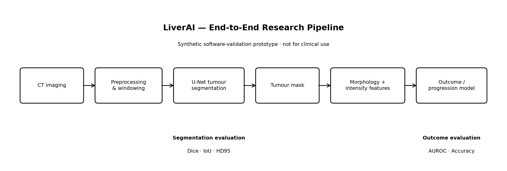
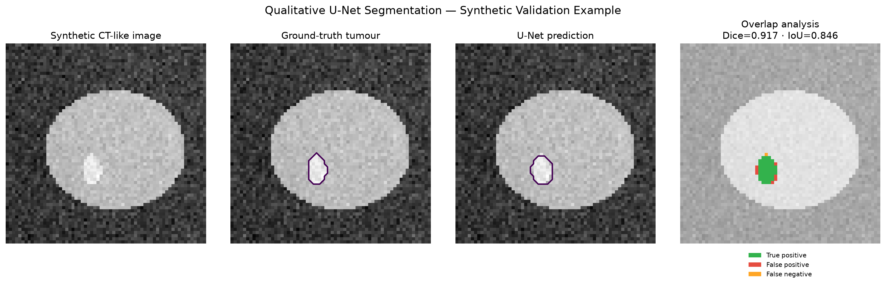
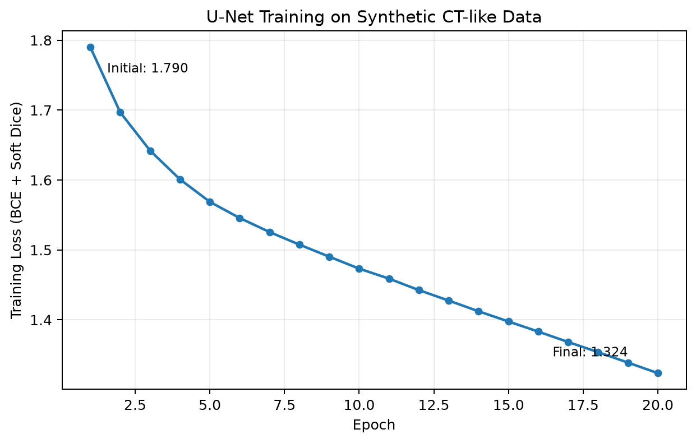

# 04 — LiverAI: Deep Learning for Liver Tumour Segmentation & Outcome Analysis


> **Medical imaging · deep learning · tumour segmentation · quantitative imaging · outcome modelling**

LiverAI is a reproducible research prototype exploring how **deep-learning-based liver tumour segmentation** can be connected to **quantitative imaging features** and downstream **patient-level outcome modelling**.

The project implements an end-to-end experimental pipeline spanning synthetic CT-like image generation, preprocessing, U-Net segmentation, quantitative tumour characterization, segmentation evaluation and an outcome-prediction scaffold.

Its longer-term research direction is to investigate how **deep image representations, tumour morphology and longitudinal clinical outcomes** can be combined to characterize liver cancer progression.

> **Clinical safety:** this repository is a research and educational prototype and is **not for clinical use**. The executable demo uses deterministic synthetic CT-like data. Reported metrics validate software behaviour, reproducibility and experimental flow only; they are not estimates of diagnostic, prognostic or clinical performance.

---

## Research overview



The current executable prototype follows the pipeline:

**CT imaging → preprocessing → U-Net tumour segmentation → tumour mask → morphology/intensity features → outcome-prediction scaffold**

Segmentation is evaluated using **Dice, IoU and HD95**. A downstream synthetic outcome proxy is used to verify that imaging-derived features can flow through a complete patient-level modelling pipeline.

The distinction between **software validation** and **clinical validation** is intentional: progression modelling on real patients requires longitudinal imaging, clinically meaningful endpoints and appropriate temporal validation.

---

## Research question

Liver cancer imaging provides a clinically relevant setting for a broader medical-AI question:

> **How can deep image representations, explicit tumour morphology and patient-level longitudinal information be combined to characterize disease and ultimately model cancer progression?**

This question connects three research areas:

- **deep learning for medical image segmentation;**
- **quantitative tumour phenotyping and representation learning;**
- **patient-level predictive modelling from imaging-derived information.**

The current repository establishes the engineering and methodological foundation required to investigate that question on real medical imaging cohorts.

---

## What is implemented?

The repository currently provides:

- deterministic synthetic CT-like data generation for reproducible software validation;
- a compact **2-D U-Net** implemented in PyTorch;
- a combined **binary cross-entropy + soft-Dice loss**;
- segmentation evaluation using **Dice, IoU and HD95**;
- quantitative tumour morphology descriptors, including size, equivalent diameter, extent and component count;
- masked intensity descriptors;
- a patient/case-level **outcome-prediction scaffold** based on quantitative imaging features;
- qualitative segmentation and error visualization;
- automated tests;
- a reproducible end-to-end experiment;
- research, data and model documentation describing assumptions and limitations.

The implementation deliberately separates what is **currently executable** from what belongs to the **real-data research roadmap**.

---

## Synthetic validation results

The reproducible reference experiment uses **64 deterministic synthetic CT-like cases**, a compact 2-D U-Net and **20 training epochs on CPU**.

### Segmentation

| Metric | Held-out synthetic result |
|---|---:|
| Dice | **0.892 ± 0.052** |
| IoU | **0.808** |
| HD95 | **1.0 pixel** |

### Outcome-prediction scaffold

| Metric | Synthetic result |
|---|---:|
| AUROC | **0.937** |
| Accuracy | **0.813** |

The U-Net training objective decreased from approximately **1.790 to 1.324** over 20 epochs.

> **Important:** these values come exclusively from synthetic software-validation data. The synthetic outcome labels are partially generated from tumour burden. Consequently, the AUROC and accuracy demonstrate that the downstream modelling pipeline executes correctly; they **must not be interpreted as evidence of liver-cancer progression prediction performance**.

---

## Qualitative segmentation and error analysis



The visualization reports the segmentation for one held-out synthetic example and distinguishes:

- **true-positive tumour regions**;
- **false-positive regions**;
- **false-negative regions**.

The Dice and IoU displayed inside this figure correspond to the **single visualized case**, whereas the table above reports aggregate performance across the held-out synthetic test cases.

This distinction is important when interpreting qualitative examples versus dataset-level evaluation.

---

## Training behaviour



The decreasing training objective confirms that the optimization pipeline executes successfully on the deterministic synthetic experiment.

The curve is intended as an **engineering and reproducibility check**, rather than evidence of generalization to clinical CT.

---

## Reproducible demo

### 1. Create the environment

```bash
cd 04-liver-tumor-deep-learning
python -m venv .venv
```

### Windows PowerShell

```powershell
.\.venv\Scripts\Activate.ps1
python -m pip install --upgrade pip
python -m pip install -r requirements.txt
```

### macOS / Linux

```bash
source .venv/bin/activate
python -m pip install --upgrade pip
python -m pip install -r requirements.txt
```

### 2. Run the tests

```bash
python -m pytest -q
```

### 3. Run the complete experiment

```bash
python scripts/run_demo.py
```

The experiment trains and evaluates the U-Net, executes the downstream outcome proxy and generates:

```text
results/demo_metrics.json
results/demo_unet_state_dict.pt

figures/research_pipeline.png
figures/demo_training_curve.png
figures/demo_segmentation.png
```

The random seeds and synthetic-data generation are controlled to make the reference experiment reproducible.

---

## From prototype to real liver CT research

The repository deliberately does **not** distribute patient data.

The next major research milestone is therefore to move from synthetic software validation to an authorised liver CT dataset, for example a public research cohort such as **LiTS**, subject to its applicable access and licensing conditions.

A research-grade extension would introduce:

1. **real volumetric CT ingestion**  
   NIfTI/DICOM loading, orientation handling, voxel-spacing normalization and CT intensity preprocessing;

2. **patient-level experimental design**  
   strict train/validation/test separation at patient level to prevent information leakage;

3. **3-D or 2.5-D tumour segmentation**  
   comparison with stronger medical-imaging baselines such as MONAI-based architectures and nnU-Net;

4. **lesion-level evaluation**  
   Dice and surface-distance metrics complemented by lesion detection and lesion-wise error analysis;

5. **richer tumour representations**  
   deep encoder representations combined with morphology, intensity, shape and radiomic descriptors;

6. **longitudinal outcome modelling**  
   progression analysis using genuine temporal imaging and clinically meaningful patient outcomes;

7. **clinical-AI validation methodology**  
   uncertainty estimation, calibration, subgroup/error analysis and external validation where appropriate.

This progression would transform the current reproducible prototype into an experimental framework suitable for investigating **medical image representations and liver-cancer progression modelling**.

See [`docs/RESEARCH_NOTE.md`](docs/RESEARCH_NOTE.md) for the methodological roadmap.

---

## Research engineering principles

The project is intentionally structured around several principles important in medical-AI research:

**Reproducibility.**  
The executable reference experiment is deterministic and its metrics and figures are generated directly from code.

**Explicit evaluation.**  
Segmentation quality is assessed quantitatively rather than relying only on visual examples.

**Error analysis.**  
Predictions can be inspected in terms of true-positive, false-positive and false-negative regions.

**Patient-level thinking.**  
The pipeline extends beyond pixel segmentation toward imaging-derived representations suitable for downstream patient-level modelling.

**Scientific restraint.**  
Synthetic results are clearly separated from clinical claims, and limitations are documented rather than hidden.

---

## Repository structure

```text
04-liver-tumor-deep-learning/
├── configs/
│   └── baseline.yaml
├── docs/
│   ├── DATA_CARD.md
│   ├── MODEL_CARD.md
│   └── RESEARCH_NOTE.md
├── figures/
│   ├── research_pipeline.png
│   ├── demo_segmentation.png
│   └── demo_training_curve.png
├── results/
│   ├── demo_metrics.json
│   └── demo_unet_state_dict.pt
├── scripts/
│   └── run_demo.py
├── src/
│   └── liver_ai/
│       ├── models/
│       │   └── unet2d.py
│       ├── features.py
│       ├── metrics.py
│       ├── prediction.py
│       ├── preprocessing.py
│       ├── real_data.py
│       ├── synthetic.py
│       ├── training.py
│       └── visualization.py
├── tests/
├── CITATION.cff
├── pyproject.toml
└── requirements.txt
```

---

## Scientific limitations

The current implementation has several deliberate limitations:

- synthetic CT-like images do not reproduce true liver anatomy, scanner variability or tumour heterogeneity;
- the reference segmentation network is **2-D**, whereas clinical CT is volumetric;
- the synthetic outcome labels are partially constructed from tumour burden;
- the downstream AUROC and accuracy therefore cannot establish prognostic validity;
- the current feature-based outcome model is a scaffold rather than a validated cancer-progression model;
- real progression research requires longitudinal patient data, clinically meaningful endpoints and appropriate temporal validation;
- external validation would be required before making claims about generalization.

These limitations define the next research questions rather than being concealed weaknesses of the demonstration.

---

## Technologies

**Current implementation**

Python · PyTorch · NumPy · SciPy · scikit-learn · Matplotlib · pytest

**Planned real-data research extension**

MONAI · nibabel / SimpleITK · nnU-Net · radiomics · volumetric medical-image processing

---

## Author

**Dini Ahamada**

AI applied to healthcare · medical imaging · deep learning · clinical decision-support research